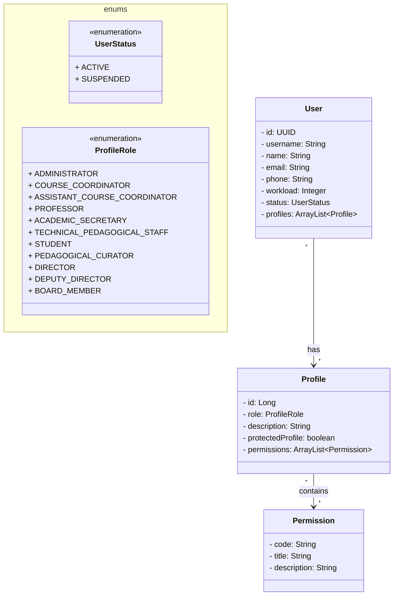
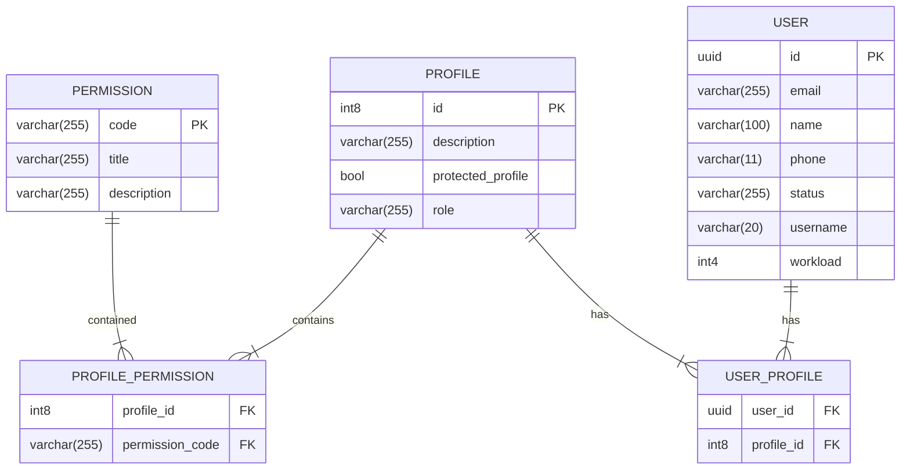

# SOCC Fullstack

Projeto fullstack com backend Spring Boot e frontend Angular.

## Estrutura do Projeto

```
SOCC-fullstack/
├── backend/           # Aplicação Spring Boot
│   ├── src/
│   │   ├── main/
│   │   │   ├── java/com/project/socc/
│   │   │   │   ├── controllers/    # Controladores REST
│   │   │   │   ├── services/       # Lógica de negócio
│   │   │   │   ├── repositories/   # Acesso a dados
│   │   │   │   ├── entities/       # Entidades JPA
│   │   │   │   ├── dtos/           # Objetos de transferência
│   │   │   │   ├── exceptions/     # Tratamento de exceções
│   │   │   │   ├── enums/          # Enumerações
│   │   │   │   ├── config/         # Configurações
│   │   │   │   └── utils/          # Utilitários
│   │   │   └── resources/          # Arquivos de configuração
│   │   └── test/                   # Testes
│   ├── pom.xml                     # Dependências Maven
│   └── mvnw                        # Wrapper Maven
└── frontend/          # Aplicação Angular
    ├── src/
    │   ├── app/
    │   │   ├── components/         # Componentes reutilizáveis
    │   │   ├── services/           # Serviços para API
    │   │   ├── models/             # Interfaces TypeScript
    │   │   ├── guards/             # Guards de rota
    │   │   ├── interceptors/       # Interceptors HTTP
    │   │   ├── pipes/              # Pipes customizados
    │   │   └── shared/             # Módulos compartilhados
    │   ├── assets/                 # Arquivos estáticos
    │   └── environments/           # Configurações de ambiente
    ├── package.json                # Dependências npm
    └── angular.json                # Configuração Angular
```

## Backend (Spring Boot)

### Pré-requisitos
- Java 17 ou superior
- Maven

### Executando o backend

```bash
cd backend
./mvnw spring-boot:run
```

A API estará disponível em `http://localhost:8080`

## Frontend (Angular)

### Pré-requisitos
- Node.js 18 ou superior
- npm

### Executando o frontend

```bash
cd frontend
npm install
npm start
```

A aplicação estará disponível em `http://localhost:4200`

## Funcionalidades

### Backend
- ✅ API REST com Spring Boot
- ✅ Estrutura MVC organizada
- ✅ Entidades JPA configuradas
- ✅ Controladores para usuários
- ✅ Tratamento de exceções
- ✅ DTOs para transferência de dados

### Frontend
- ✅ Aplicação Angular 17
- ✅ Estrutura organizada
- ✅ Componente Hello World
- ✅ Estilos SCSS
- ✅ Roteamento básico
- ✅ Preparado para integração com backend

## Desenvolvimento

### Backend
- Use `./mvnw test` para executar testes
- Use `./mvnw clean install` para build completo

### Frontend
- Use `npm test` para executar testes
- Use `npm run build` para build de produção

## Próximos passos

1. Implementar autenticação JWT
2. Criar componentes específicos no frontend
3. Implementar serviços de comunicação com API
4. Adicionar validações de formulário
5. Implementar testes automatizados

# Sistema de Oferta de Componentes Curriculares (SOCC)
Repositório destinado ao Trabalho Incremental do Grupo 5 da disciplina de Desenvolvimento FullStack.

## 📌 Membros
* Gustavo Neves Piedade Louzada
* Hafy Mourad Jacoub de Cuba Kouzak
* Igor Rodrigues Castilho
* João Victor de Paiva Albuquerque
* Maria Eduarda de Campos Ramos

## 📌 Caso de Uso: Manter Usuário
* Listar dados dos usuários (FP)
* Atribuir perfil ao usuário (FA01)
* Alterar status do usuário (FA02)

## 📌 Diagrama de Classes



## 📌 Diagrama do Banco de Dados


## 📌 Rotas
Considerando nosso caso de uso, teríamos os seguintes métodos HTTP:
* **POST /users:** Criar um novo usuário
* **GET /users:** Resgatar os dados de todos os usuários (com paginação)
* **GET /users/{id}:** Resgatar os dados de um usuário específico
* **PATCH /users/{id}:** Vai atualizar parcialmente os dados de um usuário, em particular os perfis que ele possui no sistema e o seu status

> Os grupos responsáveis pela manutenção do perfil (Grupo 7) e pelo gerenciamento de permissões (Grupo 8) serão encarregados de implementar as rotas e operações CRUD das entidades relacionadas a Perfil (Profile) e Permissões (Permission). Portanto, o nosso foco será direcionado especificamente aos itens do nosso caso de uso: o Usuário (User).

## 📌 Documentação API (Back-End)

Para mais detalhes sobre os endpoints da API — incluindo exemplos de parâmetros, RequestBody e ResponseBody — consulte a [documentação completa aqui](https://www.postman.com/ultralight-4892/projeto-final-de-desenvolvimento-fullstack/overview). 

Também é possível visualizar e testar os endpoints diretamente através do Swagger da API. Basta executar a aplicação e acessar: ```http://localhost:8080/swagger-ui/index.html```.
