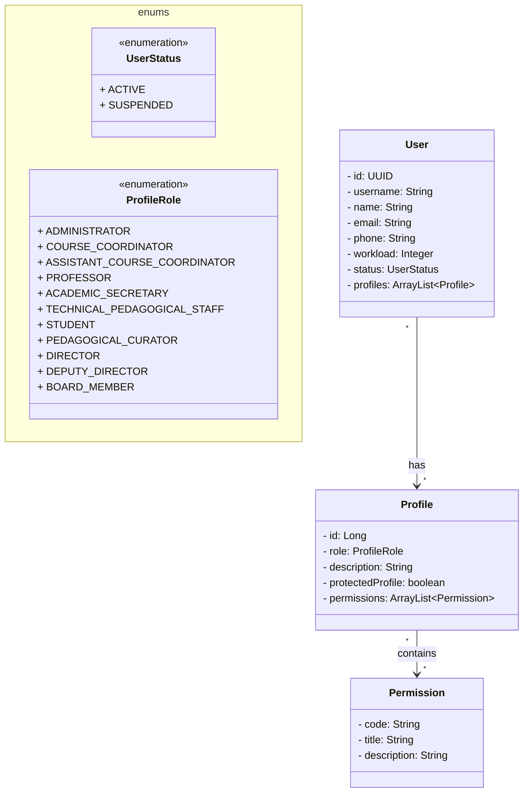
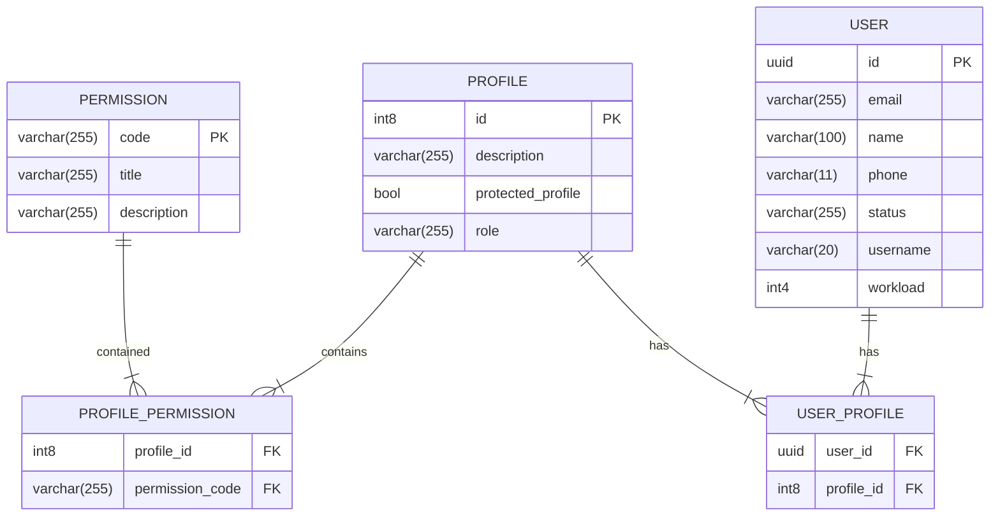

# Sistema de Oferta de Componentes Curriculares (SOCC)
Repositório destinado ao Trabalho Incremental do Grupo 5 da disciplina de Desenvolvimento FullStack.

## 📌 Membros
* Gustavo Neves Piedade Louzada
* Hafy Mourad Jacoub de Cuba Kouzak
* Igor Rodrigues Castilho
* João Victor de Paiva Albuquerque
* Maria Eduarda de Campos Ramos

## 📌 Caso de Uso: Manter Usuário
* Listar dados dos usuários (FP)
* Atribuir perfil ao usuário (FA01)
* Alterar status do usuário (FA02)

## 📌 Diagrama de Classes

## 📌 Diagrama do Banco de Dados

## 📌 Rotas
Considerando nosso caso de uso, teríamos os seguintes métodos HTTP:
* **POST /users:** Criar um novo usuário
* **GET /users:** Resgatar os dados de todos os usuários (com paginação)
* **GET /users/{id}:** Resgatar os dados de um usuário específico
* **PATCH /users/{id}:** Vai atualizar parcialmente os dados de um usuário, em particular os perfis que ele possui no sistema e o seu status

> Os grupos responsáveis pela manutenção do perfil (Grupo 7) e pelo gerenciamento de permissões (Grupo 8) serão encarregados de implementar as rotas e operações CRUD das entidades relacionadas a Perfil (Profile) e Permissões (Permission). Portanto, o nosso foco será direcionado especificamente aos itens do nosso caso de uso: o Usuário (User).
